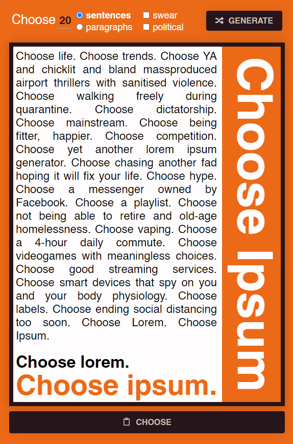

<h1 align="center">
  <a href="https://atilioa.github.io/ChooseIpsum">
   
   <br/>
  💉 Choose Ipsum

   </a>
  <br>
</h1>

<h4 align="center">
  A Lorem Ipsum generator inspired by Trainspotting's Choose Life.
</h4>

<h5 align="center">

[](https://inmetbot.herokuapp.com) [](https://www.gnu.org/licenses/gpl-3.0) 

</h5>

<p align="center">
  <a href="#ℹ-about">About</a> |
  <a href="#⚙-api">API</a> |
  <a href="#🏡-running-locally">Running locally</a>
</p>

# ℹ About

This is a Lorem Ipsum generator made with ReactJS. It is inspired by [Trainspotting's Choose Life](https://www.youtube.com/watch?v=Fsk2IU9JQZ0) and was a constructive small project to learn React on my own.

The application is composed by a RESTful API made with Express and a website running React.

<div align="center">

</div>

# ⚙ API (WIP)

All API access is over HTTPS, and accessed from https://chooseipsum.herokuapp.com/api

## Typical request:

```bash
curl -i https://chooseipsum.herokuapp.com/api?sentences=5
```

```bash
HTTP/1.1 200 OK
X-Powered-By: Express
Content-Type: application/json; charset=utf-8
Content-Length: 349
ETag: W/"16a-FtCDoVVMzRQhj2DUQvzSktJqzY4"
Date: Mon, 15 Jun 2020 21:03:37 GMT
Connection: keep-alive
{
  "startWithChooseLife": true,
  "nSentences": "5",
  "swear": true,
  "political": true,
  "endWithChooseIpsum": true,
  "format": "json",
  "chooseIpsum": "Choose life. Choose being fitter, happier. Choose key performance indicators. Choose mass shootings. Choose entrepreneurship. Choose slave-made clothes. Choose Lorem. Choose Ipsum."
}
```

## Parameters

All parameters are optional and have default values.

- `startWithChooseLife`: whether the lorem ipsum text should begin with _"Choose life."_. Default: `true`;
- `nSentences`: how many sentences to generate. Default: 20.
- `nParagraphs`: how many paragraphs to generate. If this value is informed, `nSentences` value will be ignored. Default: 3;
- `swear`: whether to include sentences with swear words. Default: `true`;
- `political`: whether to include sentences with political content. Default: `true`;
- `endWithChooseIpsum`: whether the lorem ipsum text should end with _"Choose lorem. Choose ipsum."_. Default: `true`;
- `format`: format of the response (txt, HTML or json). Default: `json`.

### Example of return using all parameters:

```bash
{
  "startWithChooseLife": false,
  "nParagraphs": "2",
  "swear": false,
  "political": false,
  "endWithChooseIpsum": false,
  "format": "json",
  "chooseIpsum": [
    "Choose essential oils. Choose dictatorship. Choose mindless distractions but also mindfulness at work. Choose Himalayan salt. Choose walking freely during quarantine. Choose overpriced hardware. Choose this lorem ipsum generator. Choose smart devices that spy on you and your body physiology. Choose not being able to retire and old-age homelessness. Choose mainstream. Choose internet challenges. ",
    "Choose YA and chicklit and bland massproduced airport thrillers with sanitized violence. Choose Alexa, Google Home, Siri. Choose fads. Choose videogames with meaningless choices. Choose your feed. Choose this lorem ipsum generator. Choose a messenger owned by Facebook. Choose mainstream. Choose dictatorship. Choose being the victim of the Dunning-Kruger effect. Choose Xanax. Choose burnout syndrome. Choose hydroxychloroquine. Choose creative idleness. "
  ]
}
```

# 🏡 Running locally

## Back-end

1. Clone the repository and enter the folder with your terminal. Then, install all back-end dependencies by executing `npm install` or `yarn`.

2. Set the `PORT` environment variable in the `.env.example` file to your desired port and rename the file to `.env` or, alternatively, set `PORT` as an environment variable of the system hosting the application.

3. Start the server with `yarn dev`.

## Front-end

Please note that the front-end of this application does not make any requests to the back-end. Texts are generated in the browser.

1. Access the `web/` directory with your terminal. Install all front-end dependencies with `npm install` or `yarn`.

2. Start the front-end application with `yarn start`.
